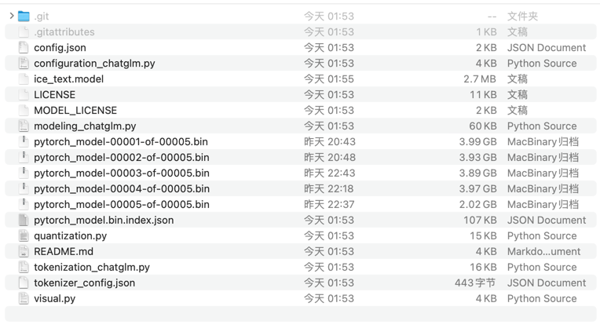
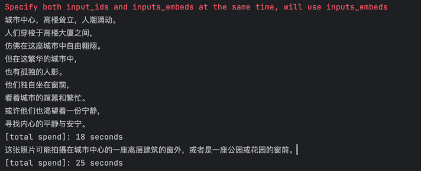
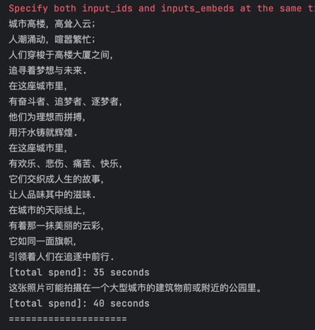

# 🚀💻 初窥 THUDM / VisualGLM-6B模型 🌟🧩

## 摘要
在Mac M2上试运行 VisualGLM-6B 模型进行图片解读


## Mac 环境
Mac pro, Apple M2 MAX, memory 64G, Mac os 13.3.1

## 部署

安装部署和ChatGLM-6B差不多，只是模型不同。   
安装前可以参考《在Mac上尝试运行ChatGLM-6B模型：一段充满挑战与探索的旅程》把python、Mac环境准备好。   
如果之前已经跑过 ChatGLM-6B，那可以直接从下载模型开始。

1. 下载模型  
    首先，从 Hugging Face Hub 下载模型需要先安装Git LFS 👉👉👉[这里有详细的安装步骤](https://docs.github.com/zh/repositories/working-with-files/managing-large-files/installing-git-large-file-storage)👈👈👈    
    然后用git把模型拉到本地，这个步骤非常非常慢，我试了几次没成功。如果不成功，可以采用下面 *模型实现* + 手动下*模型参数文件*的方式。
    ```Shell
    git clone https://huggingface.co/THUDM/visualglm-6b
    ```
    如果直接拉模型失败，可以用以下命令只下载*模型实现*。
    ```Shell
    GIT_LFS_SKIP_SMUDGE=1 git clone https://huggingface.co/THUDM/visualglm-6b
    ```
    然后，手动下载*模型参数文件*[visualglm-6b 模型文件](https://cloud.tsinghua.edu.cn/d/43ffb021ca5f4897b56a/)
    再把下载下来的模型文件，替换掉上一步骤里的文件。(记下模型目录，等下代码里会需要用到。)
    这样模型就下好了，目录结构如下：      
    

2. 安装模型需要的依赖
    以下是官网repo里requirements.txt的内容。
    ```
    # requirements.txt
    SwissArmyTransformer>=0.3.6
    torch>1.10.0
    torchvision
    transformers>=4.27.1
    mdtex2html
    gradio
    ```
    你也可以运行以下命令来安装
    ```Shell
    pip install -i https://pypi.org/simple -r requirements.txt
    # 国内可使用aliyun镜像，命令如下
    pip install -i https://mirrors.aliyun.com/pypi/simple/ -r requirements.txt
    ```

3. tips
如果在运行时出现以下runtime error， 有可能是 ice_text.model 没正常下载。从HF重新下载即可。
```

RuntimeError: Internal: /Users/runner/work/sentencepiece/sentencepiece/src/sentencepiece_processor.cc(1102) [model_proto->ParseFromArray(serialized.data(), serialized.size())]

```


## 试跑DEMO
到此，模型和环境都已经准备好了,可以开始运行代码罗～～ 找几张图片，跑起来吧～🏃🏃‍🏃‍

### demo 代码

```demo_visual.py
import torch
from transformers import AutoTokenizer, AutoModel
from dateutil import rrule
from datetime import datetime

chatglm_path = '/Users/xxxxx/llm-model/visualglm-6b<< 改成你的存放模型的目录'

DEVICE = "cuda" if torch.cuda.is_available() else "mps" if torch.backends.mps.is_available() else "cpu"
print(f"DEVICE:{DEVICE}")

tokenizer = AutoTokenizer.from_pretrained(chatglm_path, trust_remote_code=True, revision="v1.1.0")
model = AutoModel.from_pretrained(chatglm_path, trust_remote_code=True, revision="v1.1.0").half().to(DEVICE)
# model = model.eval()

my_now = datetime.now()
image_path = "imgs/coffee.pic.jpg" # 指定图片路径
response, history = model.chat(tokenizer, image_path, "描述这张图片。", history=[])
print(response)
print(history)
print(f"[total spend]: {rrule.rrule(freq=rrule.SECONDLY, dtstart=my_now, until=datetime.now()).count()} seconds")

response, history = model.chat(tokenizer, image_path, "这张图片可能是在什么场所拍摄的？", history=history)
print(response)
print(history)
print(f"[total spend]: {rrule.rrule(freq=rrule.SECONDLY, dtstart=my_now, until=datetime.now()).count()} seconds")

print("=====================")
image_path = "imgs/pycharm1.png" # 指定图片路径
response, history = model.chat(tokenizer, image_path, "描述这张图片。", history=[])
print(response)
print(history)
print(f"[total spend]: {rrule.rrule(freq=rrule.SECONDLY, dtstart=my_now, until=datetime.now()).count()} seconds")

response, history = model.chat(tokenizer, image_path, "这张图片可能是在什么场所拍摄的？", history=history)
print(response)
print(history)
print(f"[total spend]: {rrule.rrule(freq=rrule.SECONDLY, dtstart=my_now, until=datetime.now()).count()} seconds")

```

### 执行结果：
#### 例子1   
原图片：   
  

模型输出1：    

    

模型输出2：    

  


#### 例子2   
原图片：   
 
```   
模型输出的描述:    
女子戴口罩打拳击，手舞足蹈，似乎充满了力量。她的身影在白板上留下一道剪影，犹如一位勇敢的战士。
她的呼吸急促而有力，如同一只狮子的咆哮声。她的眼神坚定而又神秘，仿佛有着无尽的能量和力量。
她的力量来自内心，来自于内心的坚强和勇气。


模型输出的拍摄地点:
这张照片可能拍摄于一个拳击馆或健身房等室内空间中。
在这样的环境中，人们可以更加专注于训练、锻炼和比赛等活动，享受运动带来的快乐和健康。
```

🎉 🎉 🎉 🎉 🎉 🎉    
🎉 🎉 🎉 🎉 🎉 🎉     
🎉 🎉 🎉 🎉 🎉 🎉      


## 写在后面
从示例运行结果来看，VisualGLM-6B正如它官网所说，还是V1阶段，存在幻视、细节不足等问题。 
但现阶段用来玩玩，还是不错的。随手拍张照片，它就能生成出一段很有诗意的文字，这谁又能拒绝呢？

嗯，同时，也期待新版本的发布。


这里只分享了在Mac M2上的对模型的简单调用。更多示例代码，或想对模型进行微调....，可在官网查询更详细的说明与步骤哦。   
Have Fun！🥳🌈


## VisualGLM-6B 介绍
VisualGLM-6B 是一个开源的，支持图像、中文和英文的多模态对话语言模型，语言模型基于 ChatGLM-6B，具有 62 亿参数；图像部分通过训练 BLIP2-Qformer 构建起视觉模型与语言模型的桥梁，整体模型共78亿参数。

VisualGLM-6B 依靠来自于 CogView 数据集的30M高质量中文图文对，与300M经过筛选的英文图文对进行预训练，中英文权重相同。该训练方式较好地将视觉信息对齐到ChatGLM的语义空间；之后的微调阶段，模型在长视觉问答数据上训练，以生成符合人类偏好的答案。

VisualGLM-6B 由 SwissArmyTransformer(简称sat) 库训练，这是一个支持Transformer灵活修改、训练的工具库，支持Lora、P-tuning等参数高效微调方法。本项目提供了符合用户习惯的huggingface接口，也提供了基于sat的接口。

结合模型量化技术，用户可以在消费级的显卡上进行本地部署（INT4量化级别下最低只需8.7G显存）。

#### 协议

VisualGLM-6B 模型的权重的使用则需要遵循 [Model License](https://github.com/THUDM/VisualGLM-6B/blob/main/MODEL_LICENSE.txt)。
(不可商用)


## 参考：
* [VisualGLM-6B GitHub](https://github.com/THUDM/VisualGLM-6B)   
* [VisualGLM-6B huggingface](https://huggingface.co/THUDM/visualglm-6b)
* [VisualGLM-6B 模型文件](https://cloud.tsinghua.edu.cn/d/43ffb021ca5f4897b56a/)  
* [本示例代码](https://github.com/janewu77/jshare-llm-demo/tree/main/VisualGLM-6B-demo)

