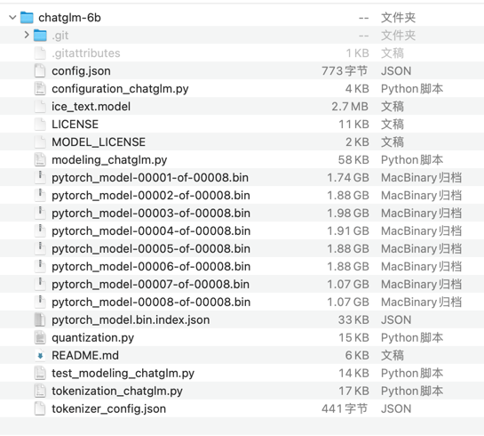
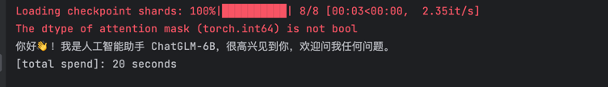

# 🚀💻 在Mac上尝试运行ChatGLM-6B模型：一段充满挑战与探索的旅程 🌟🧩

## 摘要
本文详述了在Mac M2上部署和运行ChatGLM-6B模型的方法。文章涵盖Mac环境配置、模型部署、试跑DEMO等步骤，及相关代码。成功运行后，可在有限硬件资源的电脑上使用这个中英双语问答对话语言模型。详细安装和其他环境操作请参考官网。

## 写在前面

最近发现有些模型居然可以在个人电脑上跑啦！😲🎉 我就跃跃欲试，打算在我的Mac电脑上运行ChatGLM-6B模型。

为什么选Mac呢？  
因为我手头就只有一台Mac嘛！😅   
如果我能顺利运行并训练模型，以后玩（咳咳，我是说工作）的空间可就大了哦！🎉🚀 所以我就蠢蠢地开始下手......

那为啥选ChatGLM-6B呢？   
因为它在最近的一个排名中可是名列前茅哦！🥇🏆 而且最重要的是，它对中文支持超级友好！🈵   
当然啦，实际效果还得自己试试看咯。

说实话，我对如何安装和训练模型可是一窍不通。🤷‍♀️🔧 于是我在网上搜了搜相关教程，结果看完后觉得自己像是在雾里探花，好像已经有一大堆问题等着我去挑战了呢😵。
要在硬件资源有限的电脑上运行模型确实挺有难度的，主要是因为模型对硬件需求很高，特别是GPU内存。
再者，不同电脑的硬件环境差异可不小，模型对硬件也特别敏感。所以大家遇到的问题和解决方法都千奇百怪的😅。
但最重要的是：这事儿真的可行！Mac电脑也能跑起来！💪🎊 于是我毫不犹豫地决定继续......

最后，我觉得有必要记录下每一步，包括遇到的坑和怎么爬坑的，这样和我一样对新技术感兴趣的小伙伴们也能参考啦！📝🤗💡


## Mac 环境
Mac pro, Apple M2 MAX, memory 64G, Mac os 13.3.1

## 部署

1. 安装python虚拟环境   
    Python门下万事开头，先装个虚拟环境[可选]
    （用Python 3.9也可以。在我的环境下，二者并没有什么明显差别。）

    ```Shell
    conda create -n chatglm-6b-demo-310 python=3.10
    ```
      
    切进虚拟环境
    ```Shell
    conda activate chatglm-6b-demo-310
    ```

2. 下载模型  
    首先，从 Hugging Face Hub 下载模型需要先安装Git LFS 👉👉👉[这里有详细的安装步骤](https://docs.github.com/zh/repositories/working-with-files/managing-large-files/installing-git-large-file-storage)👈👈👈    
    然后用git把模型拉到本地，这个步骤非常非常慢，我试了几次没成功。如果不成功，可以采用下面 *模型实现* + 手动下*模型参数文件*的方式。
    ```Shell
    git clone https://huggingface.co/THUDM/chatglm-6b
    ```
    如果直接拉模型失败，可以用以下命令只下载*模型实现*。
    ```Shell
    GIT_LFS_SKIP_SMUDGE=1 git clone https://huggingface.co/THUDM/chatglm-6b
    ```
    然后，手动下载*模型参数文件*[ChatGLM-6B 模型文件](https://cloud.tsinghua.edu.cn/d/fb9f16d6dc8f482596c2/)
    再把下载下来的模型文件，替换掉上一步骤里的文件。(记下模型目录，等下代码里会需要用到。)
    这样模型就下好了，目录结构如下：      
         

3. MAC准备    
按ChatGLM官网说明，如果 mac 是用Apple Silicon 或者 AMD GPU ，可以使用 MPS 后端来在 GPU 上运行 ChatGLM-6B。
可以按Apple 的 官方说明来安装PyTorch-Nightly，👉👉👉[点这里](https://developer.apple.com/metal/pytorch/)👈👈👈
⚠️注意：PyTorch-Nightly的版本号是2.1.0.dev2023xxxx，而不是2.0.0。

    ```Shell
    pip3 install --pre torch torchvision torchaudio --extra-index-url https://download.pytorch.org/whl/nightly/cpu
    ```
    安装后，写个py文件验证一下。
    ```
    import torch
    if torch.backends.mps.is_available():
        mps_device = torch.device("mps")
        x = torch.ones(1, device=mps_device)
        print (x)
    else:
        print ("MPS device not found.")
    # 正常会输出：tensor([1.], device='mps:0')
    ```

4. 安装模型需要的依赖
    以下是官网repo里requirements.txt的内容。
    ```
    # requirements.txt
    protobuf
    transformers==4.27.1
    cpm_kernels
    torch>=1.10
    gradio
    mdtex2html
    sentencepiece
    accelerate
    ```
    你也可以从我的github里下载这个文件，然后运行以下命令来安装
    ```Shell
    pip3 install -r requirements.txt
    ```


## 试跑DEMO
到此，模型和环境都已经准备好了,可以开始运行代码罗～～ 跑起来吧～🏃🏃‍🏃‍

### demo 代码

```
# demo1.py
from transformers import AutoTokenizer, AutoModel
from datetime import datetime
from dateutil import rrule

my_now = datetime.now()

# Mac 只能本地加载模型，指定本地模型目录。(就是在部署步骤2里提到的模型目录）
chatglm_path = '*******模型存放的目录*********'
tokenizer = AutoTokenizer.from_pretrained(chatglm_path, trust_remote_code=True, revision="v0.1.0")

# 如果运行时出错了，可以把half 改成 float试试。 
# 我在mac m2上，用half并不能每次都成功。
# half下出结果明显要比float快。
model = AutoModel.from_pretrained(chatglm_path, trust_remote_code=True, revision="v0.1.0").half().to('mps')
# model = AutoModel.from_pretrained(chatglm_path, trust_remote_code=True, revision="v0.1.0").float().to('mps')

# half: 8 seconds； float ： 20 seconds+
model = model.eval()
response, history = model.chat(tokenizer, "你好?", history=[])
print(response)
print(f"[total spend]: {rrule.rrule(freq=rrule.SECONDLY, dtstart=my_now, until=datetime.now()).count()} seconds")

# 50 seconds+
my_now = datetime.now()
response, history = model.chat(tokenizer, "晚上睡不着应该怎么办", history=[])
print(response)
print(f"[total spend]: {rrule.rrule(freq=rrule.SECONDLY, dtstart=my_now, until=datetime.now()).count()} seconds")

my_now = datetime.now()
response, history = model.chat(tokenizer, "晚上能喝咖啡不？", history=[])
print(response)
print(f"[total spend]: {rrule.rrule(freq=rrule.SECONDLY, dtstart=my_now, until=datetime.now()).count()} seconds")

# 6 - 12 seconds+
my_now = datetime.now()
response, history = model.chat(tokenizer, "小明的爸爸有三个儿子，大儿子叫大宝，二儿子叫二宝，三儿子叫什么？", history=[])
print(response)
print(f"[total spend]: {rrule.rrule(freq=rrule.SECONDLY, dtstart=my_now, until=datetime.now()).count()} seconds")

```

### 执行结果：
     
🎉 🎉 🎉 🎉 🎉 🎉    
🎉 🎉 🎉 🎉 🎉 🎉     
🎉 🎉 🎉 🎉 🎉 🎉      
耶，成功运行了～～ 现在就拥有了一个本地模型啦，嗯，让我想想用它来玩点什么呢？


## 写在后面
这里只分享了在Mac M2上的相关步骤哦😉。想要更详细的安装和其他环境下的操作，大家可以去查阅官网的说明📚，那里可是非常详细的呢！🎉 Have Fun！🥳🌈


## ChatGLM-6B 介绍
ChatGLM-6B 是一个开源的、支持中英双语问答的对话语言模型，基于 [General Language Model (GLM)](https://github.com/THUDM/GLM) 架构，具有 62 亿参数。结合模型量化技术，用户可以在消费级的显卡上进行本地部署（INT4 量化级别下最低只需 6GB 显存）。ChatGLM-6B 使用了和 [ChatGLM](https://chatglm.cn) 相同的技术，针对中文问答和对话进行了优化。经过约 1T 标识符的中英双语训练，辅以监督微调、反馈自助、人类反馈强化学习等技术的加持，62 亿参数的 ChatGLM-6B 已经能生成相当符合人类偏好的回答。

#### 协议

ChatGLM-6B 模型的权重的使用则需要遵循 [Model License](MODEL_LICENSE)。
(不可商用)


## 参考：
* [ChatGLM-6B GitHub](https://github.com/THUDM/ChatGLM-6B)   
* [ChatGLM-6B 模型文件](https://cloud.tsinghua.edu.cn/d/fb9f16d6dc8f482596c2/)   
* [示例代码](https://github.com/janewu77/jshare-llm-demo/tree/main/chatGLM-6b-demo)

