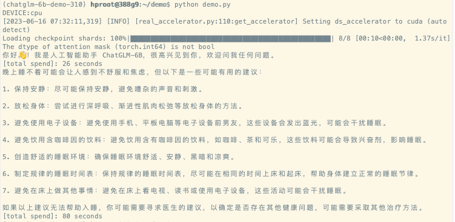

# 手把手带你一起在Ubuntu上部署chatGLM-6b模型


# 写在前面
有台闲置着的HP服务器(无GPU)，为方便之后做demo，于是拿来部署chatGLM-6b。 
操作系统：Ubuntu3.22.
GPU：无
内存：64G+

下面将从安装系统环境、安装模型和依赖、运行demo三个方面介绍chatGLM-6b的部署步骤。
如果你想把模型布在mac上，可以查看我之前的分享《在Mac上尝试运行ChatGLM-6B模型：一段充满挑战与探索的旅程》

# 环境准备
先安装conda和python。
管理python包、虚拟环境的工具，这里我用了Anaconda。这个不是必须步骤，你也可以选择其他类似工具或者跳过。

## 在Ubuntu上安装Anaconda

1. 首先，需要从Anaconda的官方网站下载适用于Linux的安装脚本。可以使用`wget`命令来下载。目前，Anaconda的最新版本是Anaconda3。以下是下载命令：

   ```bash
   wget https://repo.anaconda.com/archive/Anaconda3-2023.03-1-Linux-x86_64.sh
   ```

   注意：下载前可以去Anaconda官网查看最新的安装脚本链接。

2. 下载完成后，运行安装脚本。使用以下命令：

   ```bash
   bash Anaconda3-2023.03-1-Linux-x86_64.sh
   ```

   注意：请根据你下载的Anaconda版本修改上述命令中的文件名。

3. 安装脚本会在终端中显示许可协议，需要按 `Enter` 键滚动到底部，并键入 `yes` 来接受许可协议。

4. 然后，选择安装位置，你可以接受默认的位置或指定新的位置。我选了默认的。

5. 在安装完成后，系统会提示是否要将Anaconda的安装位置添加到`PATH`。建议选择 `yes`。

6. 完成安装后，关闭并重新打开你的终端窗口，或者输入以下命令来激活安装：

   ```bash
   source ~/.bashrc
   ```

7. 检查Anaconda是否已成功安装：

   ```bash
   conda --version
   ```

   如果这个命令返回了conda的版本号，那么说明Anaconda已经成功安装。

注意：Anaconda不是必须的，你也可以选择其他类似的工具。


## 安装 Python 

1. 创建一个新的python环境：

   ```bash
   conda create --name myenv python=3.10
   ```

   这个命令会创建一个名为 `myenv` 的新环境，并在其中安装 Python 3.10。你可以将 `myenv` 和 `3.10` 替换为你想要的环境名和 Python 版本。

2. 激活刚刚创建的新环境：

   ```bash
   conda activate myenv
   ```

   注意：你应该将 `myenv` 替换为你在上一步中设置的环境名。

3. 检查 Python 是否已经成功安装：

   ```bash
   python --version
   ```

   这个命令应该会显示你在上一步中指定的 Python 版本号。

以上就是在 Anaconda 中安装特定版本 Python 的步骤。
如果你没有创建新环境并想要在默认环境中安装新版本的 Python，你可以省略第一步和第二步，直接运行 `conda install python=3.10`。但是这样做可能会影响你的默认环境中的其他 Python 程序和库。


## 配置pip的源

访问pip的默认源有时候会比较慢，甚至超时，建议换成清华的源。

在 Anaconda 的环境中，配置 pip 的源和在常规的 Python 环境中是一样的。在 pip 的配置文件里指定源。

首先，需要找到 pip 的配置文件的位置。
- 在 Linux 或者 macOS 中，配置文件通常位于 `~/.pip/pip.conf`。
- 在 Windows 中，配置文件通常位于 `C:\Users\Username\pip\pip.ini`。

在 Anaconda 的虚拟环境中，配置文件通常位于 `${VIRTUAL_ENV}/pip.conf`，其中 `${VIRTUAL_ENV}` 就是前面的虚拟环境的目录。

在 Linux 中，你可以使用 `nano` 编辑器，来修改pip.conf

```bash
nano ~/.pip/pip.conf
```

然后，添加以下内容到文件中：

```conf
[global]
index-url = https://pypi.tuna.tsinghua.edu.cn/simple
```

以上的内容将 pip 的源更换为了清华大学的镜像源。也可以根据你的需要更换为其他的镜像源。

保存并关闭文件后，pip 将会使用新的源来下载包。


## 在ubuntu上安装 gcc 与 openmp
如果需要在 cpu 上运行量化后的模型，还需要安装 gcc 与 openmp    

GCC (GNU Compiler Collection) 是一个开源的编译器集合，其中包括了 C、C++、Objective-C、Fortran、Ada、Go 以及一些其他语言的编译器。
OpenMP (Open Multi-Processing) 是一个支持多平台共享内存并行编程的 API。

在 Ubuntu 上安装 GCC 和 OpenMP 通常非常简单，因为它们都包含在了默认的软件源中。你可以使用 apt-get（或 apt）命令来进行安装。

以下是安装 GCC 的步骤：

1. 首先，更新你的包列表：

   ```bash
   sudo apt-get update
   ```

2. 接着，安装 GCC：

   ```bash
   sudo apt-get install gcc
   ```

GCC 默认就包含了 OpenMP 支持，所以你不需要额外安装任何东西。你可以使用 `-fopenmp` 选项在编译时启用 OpenMP。

以下是一个使用 OpenMP 的简单 C 程序（hello_openmp.c）：

```c
#include <omp.h>
#include <stdio.h>

int main() {
    #pragma omp parallel
    printf("Hello, world!\n");
    return 0;
}
```

你可以使用以下命令来编译这个程序：

```bash
gcc -fopenmp hello_openmp.c -o hello_openmp
```

然后，使用以下命令来运行它：

```bash
./hello_openmp
```

这个程序会多次打印出 "Hello, world!"，打印的次数取决于你的计算机有多少个 CPU 核心。


# 安装模型运行环境

## 安装模型需要的依赖
    以下是官网repo里requirements.txt的内容。
    ```
    # requirements.txt
    protobuf
    transformers==4.27.1
    cpm_kernels
    torch>=1.10
    gradio
    mdtex2html
    sentencepiece
    accelerate
    ```

    安装
    ```Shell
    pip3 install -r requirements.txt
    ```

## 下载模型

    首先，从 Hugging Face Hub 下载模型需要先安装Git LFS 👉👉👉[这里有详细的安装步骤](https://docs.github.com/zh/repositories/working-with-files/managing-large-files/installing-git-large-file-storage)👈👈👈    
    然后用git把模型拉到本地，这个步骤非常非常慢，我试了几次没成功。如果不成功，可以采用下面 *模型实现* + 手动下*模型参数文件*的方式。
    ```Shell
    git clone https://huggingface.co/THUDM/chatglm-6b
    ```
    如果直接拉模型失败，可以用以下命令只下载*模型实现*。
    ```Shell
    GIT_LFS_SKIP_SMUDGE=1 git clone https://huggingface.co/THUDM/chatglm-6b
    ```
    然后，手动下载*模型参数文件*[ChatGLM-6B 模型文件](https://cloud.tsinghua.edu.cn/d/fb9f16d6dc8f482596c2/)
    再把下载下来的模型文件，替换掉上一步骤里的文件。(记下模型目录，等下代码里会需要用到。)
    这样模型就准备好了.


# 运行demo

可以进入python，一行行跑demo.py里的代码
``` demo.py
import torch
from transformers import AutoTokenizer, AutoModel
from datetime import datetime
from dateutil import rrule

my_now = datetime.now()

# 指定本地模型所在路径(这里改成你的模型目录哦）
chatglm_path = '/mnt/data_500g/llm-models/chatglm-6b'
# DEVICE = "cuda" if torch.cuda.is_available() else "mps" if torch.backends.mps.is_available() else "cpu"
# print(f"DEVICE:{DEVICE}")

tokenizer = AutoTokenizer.from_pretrained(chatglm_path, trust_remote_code=True, revision="v1.1.0")
# 如果只有cpu就用float跑。如果有gpu，那就用cuda。这完全取决于服务器的配置。
model = AutoModel.from_pretrained(chatglm_path, trust_remote_code=True, revision="v1.1.0").float()
# model = AutoModel.from_pretrained(chatglm_path, trust_remote_code=True, revision="v1.1.0").half().cuda()
# 按需修改，目前只支持 4/8 bit 量化
# model = AutoModel.from_pretrained(chatglm_path, trust_remote_code=True).quantize(8).half().cuda()

model = model.eval()
response, history = model.chat(tokenizer, "你好?", history=[])
print(response)
print(f"[total spend]: {rrule.rrule(freq=rrule.SECONDLY, dtstart=my_now, until=datetime.now()).count()} seconds")

my_now = datetime.now()
response, history = model.chat(tokenizer, "晚上睡不着应该怎么办", history=[])
print(response)
print(f"[total spend]: {rrule.rrule(freq=rrule.SECONDLY, dtstart=my_now, until=datetime.now()).count()} seconds")
#
# my_now = datetime.now()
# response, history = model.chat(tokenizer, "晚上能喝咖啡不？", history=[])
# print(response)
# print(f"[total spend]: {rrule.rrule(freq=rrule.SECONDLY, dtstart=my_now, until=datetime.now()).count()} seconds")
#
# my_now = datetime.now()
# response, history = model.chat(tokenizer, "小明的爸爸有三个儿子，大儿子叫大宝，二儿子叫二宝，三儿子叫什么？", history=[])
# print(response)
# print(f"[total spend]: {rrule.rrule(freq=rrule.SECONDLY, dtstart=my_now, until=datetime.now()).count()} seconds")

```
或者直接用以下命令运行demo

```bash
python demo.py
```
Demo.py的运行结果：     


注意：     
1.修改模型路径。如果是本地跑，一定要把模型路径改成你模型所在的路径。
2.如果象我这样服务器上并没有GPU的，注意改成用float()启动模型。


## 官方demo
可去官方github库下载代码
```
git clone https://github.com/THUDM/ChatGLM-6B
cd ChatGLM-6B
```
注意：如果你象上文提到的一样已经提前下载好模型了。运行前，把文件内的模型路径修改成你自己的。

### 运行web版

```
# 先装 gradio
pip install gradio
python web_demo.py
```

### 命令行模式
```
python cli_demo.py
```


### 命令行模式
```
# 先装 fastapi uvicorn
pip install fastapi uvicorn
python api.py
```


# 结尾
小结，部署步骤一共分三步：
1.安装环境：安装conda & python
2.安装模型：下载模型 & 安装模型的依整
3.检查模型是否安装成功：运行demo。

Have Fun～


## ChatGLM-6B 介绍
ChatGLM-6B 是一个开源的、支持中英双语问答的对话语言模型，基于 [General Language Model (GLM)](https://github.com/THUDM/GLM) 架构，具有 62 亿参数。结合模型量化技术，用户可以在消费级的显卡上进行本地部署（INT4 量化级别下最低只需 6GB 显存）。ChatGLM-6B 使用了和 [ChatGLM](https://chatglm.cn) 相同的技术，针对中文问答和对话进行了优化。经过约 1T 标识符的中英双语训练，辅以监督微调、反馈自助、人类反馈强化学习等技术的加持，62 亿参数的 ChatGLM-6B 已经能生成相当符合人类偏好的回答。

#### 协议

ChatGLM-6B 模型的权重的使用则需要遵循 [Model License](MODEL_LICENSE)。
(不可商用)


## 参考：
* [ChatGLM-6B GitHub](https://github.com/THUDM/ChatGLM-6B)   
* [ChatGLM-6B 模型文件](https://cloud.tsinghua.edu.cn/d/fb9f16d6dc8f482596c2/)   
* [示例代码](https://github.com/janewu77/jshare-llm-demo/tree/main/chatGLM-6b-demo/ubuntu)
* [在MAC上部署](https://github.com/janewu77/jshare-llm-demo/blob/main/chatGLM-6b-demo/README.md)

