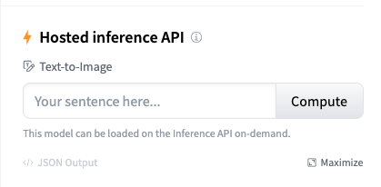
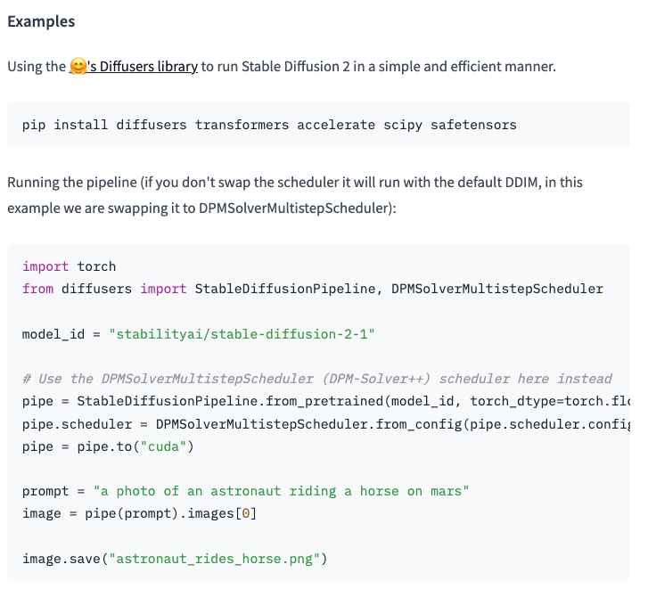

# 🚀💻周末在Mac上玩转 Stable-diffusion 模型 🌟🧩


## 前言
上个周末，从对Stable-diffusion略有耳闻开始，到产出令人心怡的卡通人物，这中间就花了1天时间。
（其中，大部分时间还是花在下载模型和找插件上面了。）

这次分享如何在Mac上安装部署Stable diffusion，我会尽量从"头"开始分享，尽量让IT小白也能上手。
同时，还会分享我安装大模型的惯用“套路”。


在开始之前，先把我的“套路”供出来：“五步部署大模型”。


五步部署大模型：
1. 找模型
2. 下模型 
3. 装模型
4. 检查模型
5. 锦上添花（可选）


安装的必要条件：
1。"畅通"的网络。（这个相信你能搞定的。）
2。Mac OS 12+, 内存至少16G。


## 1.找模型
优先选择官方、正式渠道去找模型。以下是二个找开源项目和模型的常用站点。

找模型上抱抱脸 huggingface https://huggingface.co

找代码上 github https://github.com


找模型步骤：
- 进入huggingface，搜索模型 "stable-diffusion"
- https://huggingface.co/stabilityai/stable-diffusion-2-1 这是当前（9.17）最新的SD模型
- 阅读 model card
  - 确定是否是自己要找的模型
  - 试运行（可选项），通常在页面右侧.如图     
  - 找到说明中的安装命令、验证脚本，这二项在后面的步骤会用到。如图    
  
    
## 2.下载模型 

步骤：
- 准备环境与工具
  - 装Homebrew https://brew.sh/ 命令如下。在官网首页就能看到这条命令。
    ```
    /bin/bash -c "$(curl -fsSL https://raw.githubusercontent.com/Homebrew/install/HEAD/install.sh)"
    ```
  - 装git https://git-scm.com/ 安装git的命令，同样进入官网首页后就能找到。
    ```
    brew install git
    ```
    

- 下载模型
  - 找模型文件
    仍然在 https://huggingface.co/stabilityai/stable-diffusion-2-1 官方的源站上找.
  
    在模型卡model card右边有files and versions，模型文件就都在这里。
  
  - 查看下载命令。
  
  点击右上角三个点，就能看到如何下载模型的命令。 我们就按照这些命令来执行下载。

    首先，安装Git LFS 
    ```Shell
    git lfs install
    ```
    
    然后用git把模型拉到本地，这个步骤非常慢。
    ```Shell
    git clone git@hf.co:stabilityai/stable-diffusion-2-1
    ```
  
    如果上一步拉模型失败，可以用以下命令
    ```Shell
    GIT_LFS_SKIP_SMUDGE=1 git clone git@hf.co:stabilityai/stable-diffusion-2-1
    ```
    然后，手动下载LFS文件。就是进到【files and versions】找到那些标了LFS的文件，一个个点击下载。
    再把下载下来的模型文件，替换掉上一步骤里的文件。这里一定要下齐哦，SD带有lfs的文件比较多，不要漏了，漏了可能会导致模型无法运行。
  (同时，也记下模型目录，等下验证的时候会用到这个目录名。)

    

## 3.安装模型 

这个环节也是分二个大的步骤 ：

第一个步骤：安装基本环境。很多模型都是用的差不多的环境。所以，安装过一次后，再安装其他大模型就可以跳过这一步了。

第二个步骤：安装模型的依赖包。 这是模型代赖的特定的包，不同模型的依赖会不太一样，需要特别安装的。


### 安装基本环境
1. 安装 python （必要）
   
   Mac一般会自带一个python2.x版本，这个版本太老了，所以要重新装。
   由于，前面已经装过brew，可以直接用brew安装，命令如下。也可以去python官网下载 .pkg 安装文件,来安装。
   ```
   brew install python
   ```
   安装后,可以验证下.如果显示 Python 3.1x.xx 就表示安装成功了。
   ```
   python3 -V
   ```
   
2. 安装 anaconda （可选） 
   
   去官网 https://www.anaconda.com 下载安装包，然后点击安装就行，这里不展开了。

    它是用来管理python环境的，当经常使用python时, 会经常安装不同的包，这就容易发生版本冲突，所以通常会用conda来管理虚拟环境。
   如果你只是试用一下SD,可以不往下深究，不装也是没有问题的。
   但如果你是个IT开发，经常性地需要装各种python的包，那建议去了解一下这个工具和它的常用命令。
   用它来维护python环境，会带来很多开发上的便利。       


3. 安装 PyTorch-Nightly（重要!!!)） 
   
   如果 mac 是用Apple Silicon 或者 AMD GPU ，是可以使用 MPS 后端来在 GPU 上运行 模型的。
可以按Apple 的 官方说明来安装 PyTorch-Nightly，👉👉👉[点这里](https://developer.apple.com/metal/pytorch/)👈👈👈

    有二种安装方式：

    Anaconda：
    ```commandline
    conda install pytorch torchvision torchaudio -c pytorch-nightly
    ```
   
    pip：
    ```commandline
    pip3 install --pre torch torchvision torchaudio --extra-index-url https://download.pytorch.org/whl/nightly/cpu
    ```
   
    安装后用以下命令查看是否装成功：
    ⚠️注意：PyTorch-Nightly的版本号是2.2.0.dev2023xxxx，而不是2.0.0。
    ```commandline
    pip show torch
    ```


### 安装模型的依赖包

先创建虚拟环境并进入，如果不打算使用虚拟环境，而且前面也没有装conda，那这二步可以跳过。

建虚拟环境（可选）
```commandline
conda create --name mysdenv310 python=3.10
```
进入虚拟环境（可选）
```commandline
conda activate mysdenv310
```

然后，回到 huggingface SD的model card 找到安装命令如下，同样在终端窗口里执行。
```commandline
pip install diffusers transformers accelerate scipy safetensors
```


## 4.检查安装结果

接下来，我们需要来运行一段程序，以检查模型是否安装好了。


打开一个记事本文件把下面的代码copy进去，把文件存为demo.py
这段代码是第一步骤里，在模型卡里找到的（代码略有改动）。
检查一下代码，注意把模型指向你下载的目录哦。（在第5行修改）
当碰到生成的图片是全黑的图片时，可按代码里的注释修改一下，再试。

```demo.py
import torch
from diffusers import StableDiffusionPipeline, DPMSolverMultistepScheduler

# 注意这里改成你的下载好的模型的目录！！！！！
model_id = "/Users/yourname/stabilityai/stable-diffusion-2-1"

# Use the DPMSolverMultistepScheduler (DPM-Solver++) scheduler here instead
# 如果出黑图，就换 float32 试一下。
pipe = StableDiffusionPipeline.from_pretrained(model_id, torch_dtype=torch.float16)
# pipe = StableDiffusionPipeline.from_pretrained(model_id, torch_dtype=torch.float32) 

pipe.scheduler = DPMSolverMultistepScheduler.from_config(pipe.scheduler.config)
# 注意这里是mps
pipe = pipe.to("mps") 

# Recommended if your computer has < 64 GB of RAM
# 如果跑不起来，或者黑图，把这行的#和第一个空格删掉再试试。
# pipe.enable_attention_slicing()

prompt = "a lovely cat"
image = pipe(prompt).images[0]
    
image.save("cat.png")
```

运行代码：
```commandline
python3 demo.py
```


运行结束后，一切正常的话，目录下会有一张喵星人的图片。

恭喜🎉，到这一步你已经成功地把SD模型安装在mac上，并且生成了一张图。
🎉🎉🎉快来评论区分享你的第一只AI猫长什么样吧？ 我的AI猫长长这样：
     


## 5.锦上添花
基础已经有了，接下来就取决于你要如何使用它了。不同模型在这个步骤上，就差异很大了。

走纯开发技术路线：
走到这一步，可以考虑写个API来将SD的能力整合到其他应用系统内。这需要相应的开发技术，比如python等，这里不再展开。

走纯小白操作路线：
得益于现在的开源社区，通常会有一些现成的应用，可供小白直接用。
就Stable-diffusion而言，如果提前做过一点小功课,那就一定会听说过"WEBUI"这个功能强大的东东。
即使没听过，也没关系，下面我们一起来安装方式。这是个在Stable-diffusion领域，对小白超级超级友好的操作界面。 
这必然是锦上添花的那朵花，我们必须拥有～ 

继续～


接下来安装也还是老套路，找代码上 github.
找到官方提供者，看说明，找到在Mac上的安装说明。安装说明连接如下：
https://github.com/AUTOMATIC1111/stable-diffusion-webui/wiki/Installation-on-Apple-Silicon
接下来，我们就照它来安装。 
因为前面我们已经安装过一些包和工具了，有些步骤是可以跳过的。
我把必要步骤整理如下。把命令一条条执行就行了。

```commandline
brew install cmake protobuf rust wget
git clone https://github.com/AUTOMATIC1111/stable-diffusion-webui
```
然后，把之前下的模型文件 （就是超级大的，约5G左右的模型文件） 比如这个：v2-1_768-ema-pruned.ckpt
拷贝到 stable-diffusion-webui/models/Stable-diffusion 目录下。
（以后你下别人训练好的模型文件时，一般也会放到这个目录下。）
它还需要一个配置文件
https://github.com/Stability-AI/stablediffusion/raw/main/configs/stable-diffusion/v2-inference-v.yaml 
把这个文件下载下来和模型放到同一个目录。并且把文件名改成和模型一样的。 比如, 我的就是 v2-1_768-ema-pruned.yaml

现在回到 stable-diffusion-webui 目录下，在这里你会看到一个webui.sh文件。现在来执行它。
```commandline （如果要停掉就按ctrl+C。下次再启动时，再执行这条命令即可。）
./webui.sh
```
然后，你就会看见 http://127.0.0.1:7860 这样一串，把这个copy到你的浏览器里。
你会看到类似下面的界面，接下来，就尽情地在这里操作，来生成图片吧。这个是不是比打命令更方便好用？真香
    

接下来你可去C站或者你熟悉的社区去找找做图的资源、找找有趣的风格、找找AI艺术家们，开始你的生图之旅吧～～
Have Fun～


## 小结

到此，我们已经用五步法，装好stable-diffusion 模型 、小白能上手的web-ui, 还生成了一张猫咪图片。
感觉如何？装过一遍后，部署安装大模型也没那么神秘和困难吧。
其实，了解了这几个步骤，同样可以用在部署其他大模型上。 
欢迎入坑，如果有什么问题或者有什么新鲜好玩的大模型，评论区留言讨论吧～


## 在哪里可以找到我
知乎： https://www.zhihu.com/people/janewu77
微信公众号：
github: https://github.com/janewu77


## 一些有用的资源
stable-diffusion的模型和源码库：
https://huggingface.co/stabilityai/stable-diffusion-2-1
https://github.com/Stability-AI/stablediffusion
webUI的源码库
https://github.com/AUTOMATIC1111/stable-diffusion-webui
著名C站，上面有很多素材
https://civitai.com/
ai小王子，推荐下这个号，他有很多视频是介绍stable-diffusion的，值得学习。

https://git-scm.com/
https://www.python.org/
https://anaconda.org/


-End-


